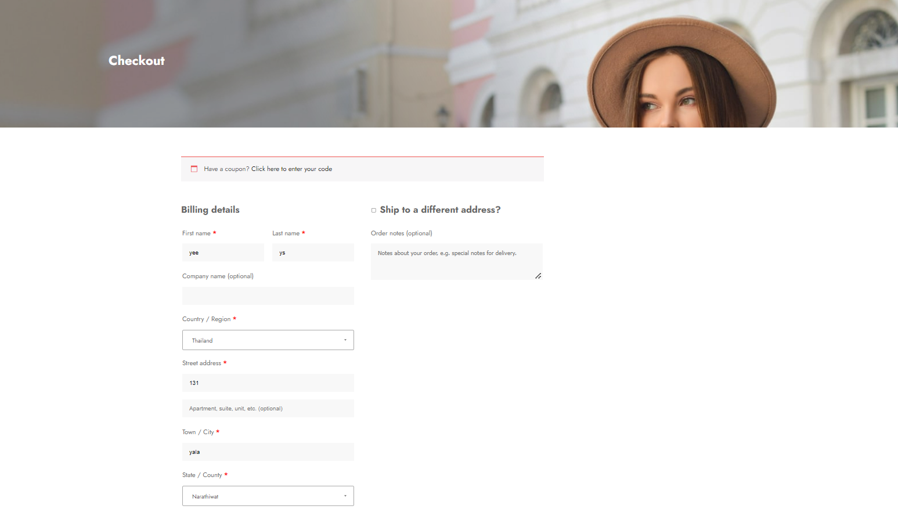
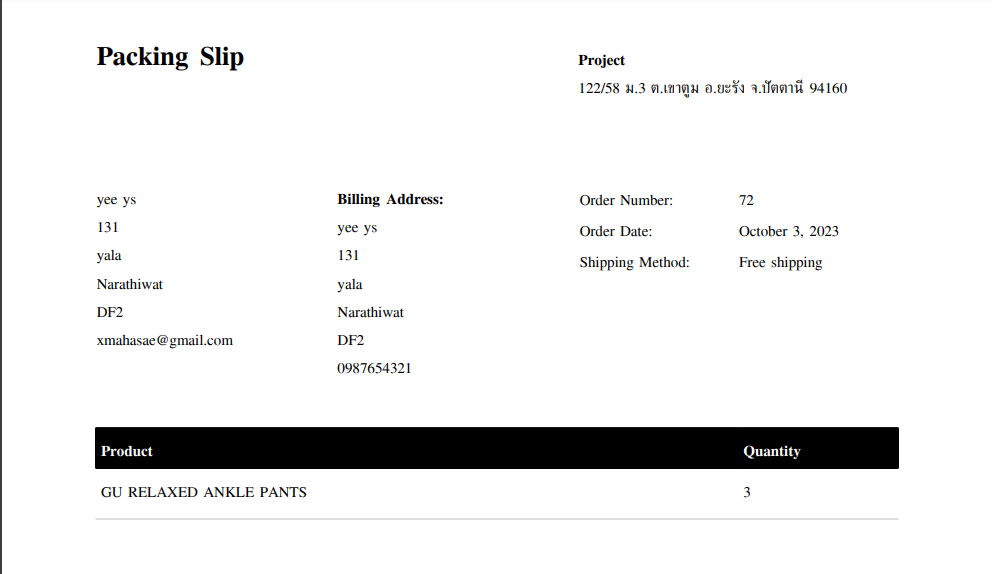
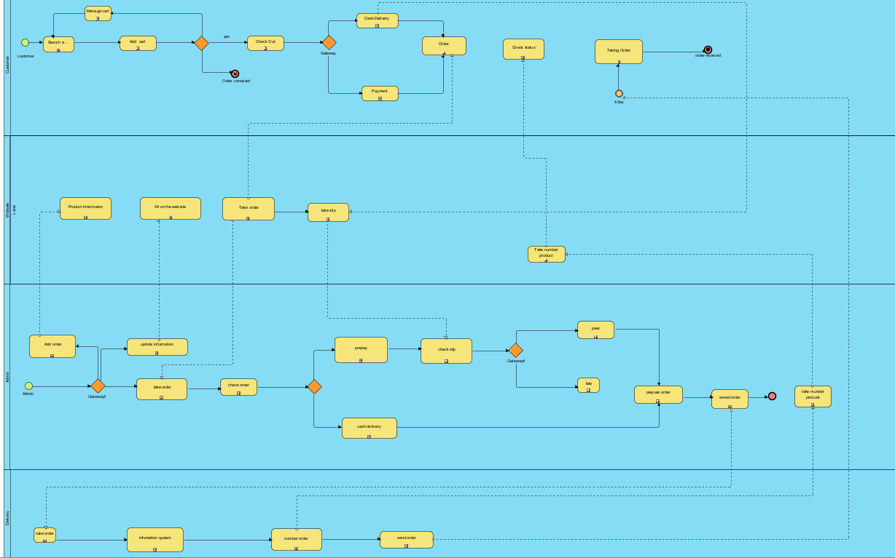

# Modern-Ecommerce-Platforms
## Design and Develop Modern Ecommerce Plafform
  This project involves creating a simple modern e-commerce platform using Wordpress forms and includes modeling of business process systems from customer until delivery. 

## 1.Introduction
   This project is about developing an e-commerce website for , a second hand  shop. The website will be built using the WordPress content management system and will include the WooCommerce plugin to facilitate a seamless e-commerce experience. This platform will allow customers to browse, choose and order online comfortable.

## 2.Software and Tools Used
- Laragon: is utilized as our local development environment, providing a convenient platform for building and testing the second hand  shop E-Commerce Website before deployment.
- WordPress: WordPress serves as the primary content management system (CMS) for our website, offering a flexible and user-friendly environment for managing web content.
- WooCommerce: is integrated seamlessly with WordPress, empowering our website with e-commerce capabilities, including product management, shopping cart functionality, and secure payment processing.
- PDF Invoices & Packing Slips for WooCommerce: is responsible for generating professional invoices and packing slips for customer orders, ensuring a smooth and professional shopping experience.

 ## 3.Visual Overview
 ### HomePage

### Shop page

### Checkout

### Statement

## All pools in BPMN
- Customer
- Admin
- Wabsite
- Delivery

## BPMN Diagram

This BPMN diagram show my E-Commerce Website processes, showcasing key interactions and workflows that enhance the platform's user-friendly online Hiyab shop experience.

## Customer pool

- Start with the green dot. It marks the beginning of the customer journey on the platform.
- Select Products: The customer selects the desired products from the available options.

## Website

- Start form the first that is product information is that can make customer choes it.
- Second is taking customer order before the data go to backend.
- Third is taking slip from customer who choes transfer before the data go to backend.

## Admin

- Correct gataway: when admin check correctness about payment. If correct, It will go to Check Stock process. If not correct, It will cancel the order.
- The next step will be preparing the customer's order. Pack the product well so that it is not damaged during the delivery.
- Next, the order will be sent to the shipping company.

## Delivery

A shipping company receives an order from an administrator to deliver goods to a customer. -And will send the parcel number to the admin so that the admin can send the parcel number to the customer. -Ext is to enter data into the system. -And the product will be delivered to the customer within at least approximately 4 days (if payment is made on delivery, we can wait to pay the shipping cost)

## Conclution
The development of an e-commerce website for  second hand  shop using WordPress and WooCommerce, supported by Laragon and essential plugins, is an exciting project with the potential to provide customers with a seamless second-hand shopping experience. By leveraging BPMN diagrams, we have visualized key processes to ensure the efficient operation of the website. This project aims to create a user-friendly and secure platform that caters to both customers and administrators, ultimately leading to a successful online second-hand shop.
